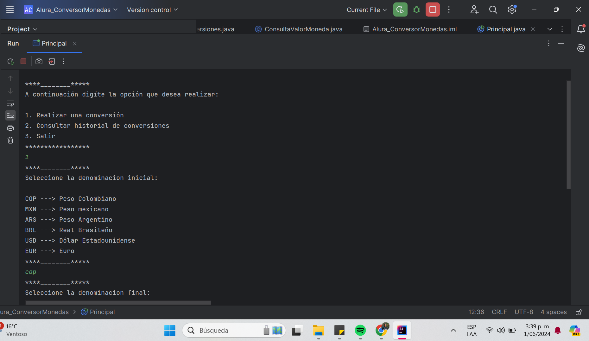
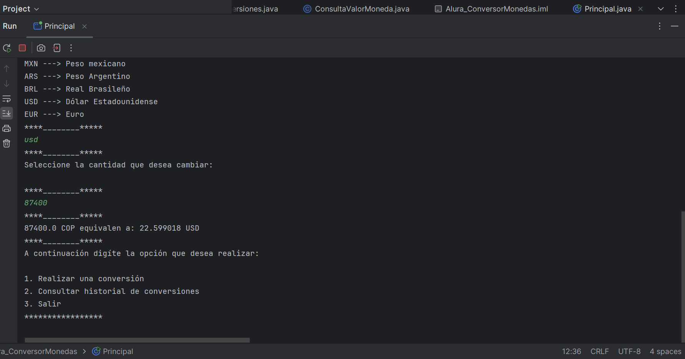
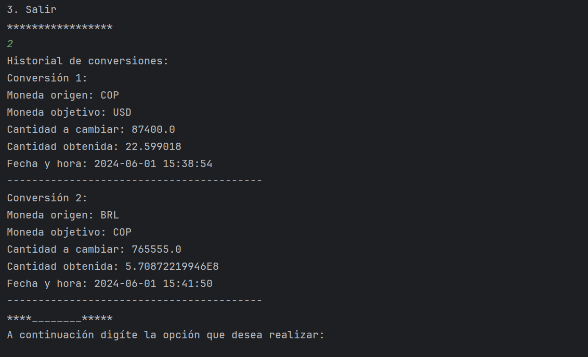

***CONVERSOR DE MONEDAS

Aplicación diseñada como desafío práctico, nos permite convertir e interactuar con diferentes monedas entre ellas:
                
                COP ---> Peso Colombiano
                MXN ---> Peso mexicano
                ARS ---> Peso Argentino
                BRL ---> Real Brasileño
                USD ---> Dólar Estadounidense
                EUR ---> Euro

Esta aplicación consume una API llamada Exchange Rate "Obtienemos las cifras actualizadas para realizar los respectivos cambios de las divisas solicitadas por el usuario en la interacción."

>>Uso

1. Realizar una conversión.
2. Consultar historial de conversiones.
3. Salir.

>>Autor

Lina M Romero "GráficaLina"
Primera versión del conversor de monedas.

